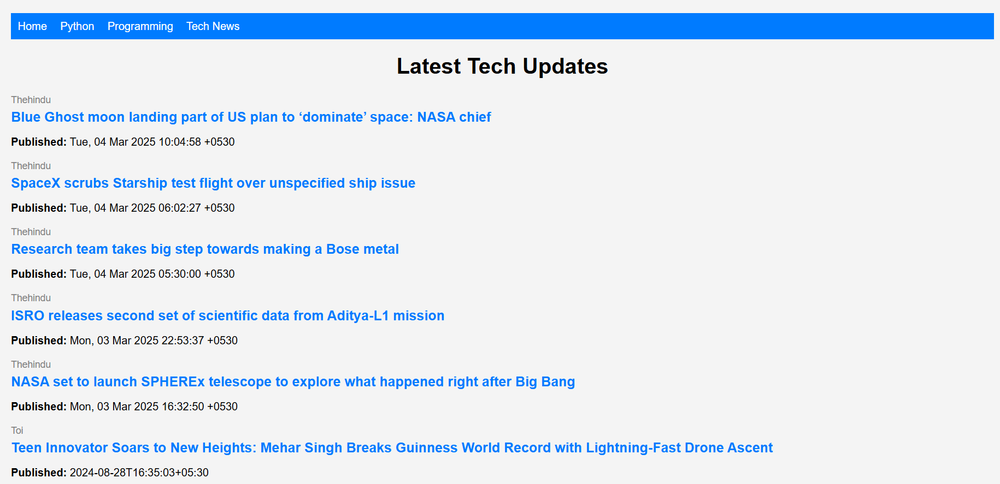

# 📌 TechPulse – A Tech & Programming News Aggregator  

TechPulse is a **FastAPI-based** web application that aggregates the latest **tech news** and **programming articles** from multiple sources. It fetches articles using **RSS feeds** and **Dev.to API**, displaying them in a structured web interface with Jinja2 templates.

---

## 🚀 Features  
✅ Fetches and displays the latest news from:  
- 📰 **The Hindu**  
- 📰 **Times of India**  
- 📰 **NDTV**  

✅ Retrieves top programming articles from **Dev.to**  
✅ Categorizes articles into:  
- 🐍 **Python**  
- 💻 **Programming**  
- 🌐 **Tech News**  

✅ **Search Feature** for better filtering  
✅ Responsive and user-friendly UI  
✅ Built with **FastAPI, Jinja2, and HTMX**  

---

## 🛠 Tech Stack  
🔹 **Backend:** FastAPI  
🔹 **Frontend:** Jinja2, HTML, CSS  
🔹 **Database (Optional):** SQLite / PostgreSQL (if adding user features)  
🔹 **APIs Used:** Dev.to API, RSS Feeds  

---

## 📥 Installation & Setup  

### 1️⃣ Clone the Repository  
```sh
git clone https://github.com/mayur-salokhe/tech-update-portal.git
cd techpulse
```

### 2️⃣ Create & Activate Virtual Environment  
```sh
python -m venv venv  
source venv/bin/activate  # On macOS/Linux
venv\Scripts\activate  # On Windows
```

### 3️⃣ Install Dependencies  
```sh
pip install -r requirements.txt
```

### 4️⃣ Run the FastAPI Server  
```sh
uvicorn main:app --reload
```

### 5️⃣ Open in Browser  
Go to **`http://127.0.0.1:8000`** to view the portal.

---

## 🖼 Screenshots  
📸 **News Page:**  
  

📸 **Python Articles Page:**  
  

📸 **Programming Articles Page:**  
  

---

## 🔗 API Endpoints  

| Method | Endpoint            | Description               |
|--------|---------------------|---------------------------|
| `GET`  | `/news`             | Fetch latest news        |
| `GET`  | `/articles/python`  | Fetch Python articles    |
| `GET`  | `/articles/programming` | Fetch programming articles |
| `GET`  | `/articles/news` | Fetch tech updates articles |

---

## 🤝 Contributing  
Want to improve TechPulse? Follow these steps:  
1. **Fork the repo**  
2. **Create a new branch** (`feature-xyz`)  
3. **Commit changes**  
4. **Submit a pull request**  

---

## 📜 License  
This project is licensed under the **MIT License**.  

---

## 📬 Contact  
For any queries, feel free to reach out:  
✉ **Email:** salokhemayur9@gmail.com
🐙 **GitHub:** https://github.com/mayur-salokhe  

